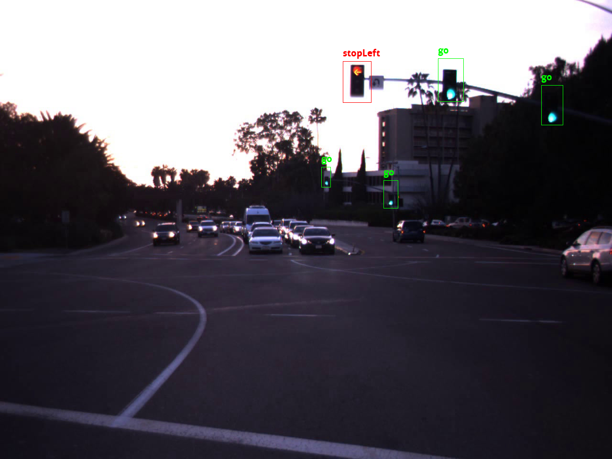

# Traffic light recognition

In this project I created a traffic light recognition system using a pretrained Faster RCNN model, fine-tuned on the [LISA Traffic Light Dataset](https://www.kaggle.com/mbornoe/lisa-traffic-light-dataset), and written in PyTorch.

## Demo
To try out this project, send a POST request to 
http://traffic-light-recognition.us-east-1.elasticbeanstalk.com/predict with an image in the `file` key.
So, for example, as a cURL command:
```
  curl --request POST 'http://traffic-light-recognition.us-east-1.elasticbeanstalk.com/predict' \
--form 'file=@/path/to/file.png'
```

This will give you the bounding boxes, scores and labels for any traffic lights the model finds in the image provided.

The model is hosted on an AWS S3 bucket. Feel free to download it to play around with it yourself:
```
wget -c https://traffic-light-model.s3.amazonaws.com/tlr_model.pth -O /tmp/tlr_model.pth
```

## Installation 
To get started, set up an virtualenv with python 3.7+ installed and run `./setup.sh`.

This will download any dependencies. If you haven't got a copy of the [dataset](https://www.kaggle.com/mbornoe/lisa-traffic-light-dataset), you can run `./setup.sh --download`, but note that you'll need to provide kaggle CLI authentication variables, like so:
`KAGGLE_USERNAME=<username> KAGGLE_KEY=<key> ./setup.sh --download`

More info on kaggle CLI authentication here: https://www.kaggle.com/docs/api#authentication

## Training
To run the training pipeline, run `python -m traffic_lights train`. This assumes the LISA dataset is stored in the root directory and named `lisa-traffic-light-dataset`. If it's stored somewhere else, use the `-d` or `--dataset` flag and specify the path, e.g. `python -m traffic_lights train -d /path/to/dataset`.

This will take some time, given the size of the dataset and the fact we're tuning the hyperparameters to get the best model. Once complete, a saved model `.pth` file will be located in the root of the repo.

## Prediction
To predict the location and state of a traffic light in a given image, run `python -m traffic_lights -i <image_file> -m <model_file>`, where `<image_file>` is the path to the image you want to predict with, and `<model_file>` is the saved trained model. This will output the bounding boxes. To plot the predictions on the image, supply an output file with `-o <output>`.

### Prediction Example
If all being well, you'll get an output image like the one below.


## Running tests
Run `python -m unittest discover -v` from the root directory.

## Notebooks
I started this project using Jupyter Notebooks, but moved away from them, for reasons that are outlined well [here](https://www.youtube.com/watch?v=7jiPeIFXb6U). I've included the notebooks in this repo under `notebooks/` for reference.
